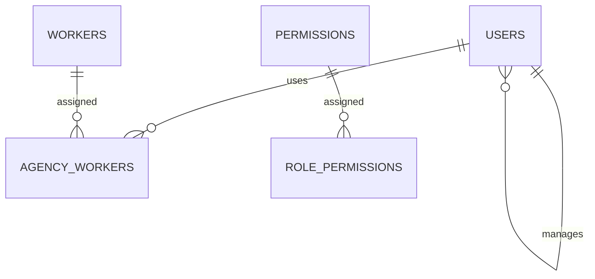

# Business Logic Document: Multi-tenant Agency System (Flattened Pattern)

Tài liệu này mô tả logic nghiệp vụ cốt lõi.

---

## 1. 🎯 Mục tiêu (Objective)

Xây dựng hệ thống quản lý đại lý đa người dùng, hỗ trợ phân bổ Worker linh hoạt và cô lập dữ liệu hiệu quả.

---

## 2. 🧩 Đối tượng & Vai trò (Roles)

Hệ thống sử dụng bảng `users` duy nhất với các vai trò:

| Role         | Mô tả                         | `parent_user_id` |
| :----------- | :---------------------------- | :--------------- |
| **MOD**      | Quản trị viên tối cao.        | `NULL`           |
| **Agency**   | Thực thể kinh doanh quản trị. | `NULL`           |
| **User**     | Nhân viên thuộc một đại lý.   | Trỏ về Agency    |
| **Customer** | Khách hàng của đại lý.        | Trỏ về Agency    |

---

## 3. 🏗️ Module chính

### 3.1 Quản lý Người dùng & Đại lý

- Mỗi Agency là một tài khoản User.
- Các tài khoản con (User/Customer) được tạo bởi Agency sẽ tự động nhận `parent_user_id` là ID của Agency đó.

### 3.2 Quản lý Worker

- Worker là tài nguyên hệ thống do MOD quản lý.
- MOD gán Worker cho Agency thông qua bảng mapping.
- **Theo dõi sử dụng**: Hệ thống ghi nhận ID của người dùng (`using_by`) đang thao tác trên Worker.

---

## 4. 🔐 Cơ chế phân quyền (RBAC)

Quyền hạn được kiểm soát thông qua các bộ mã (Code) trong bảng `permissions`.

---

## 5. 🧱 Sơ đồ ER khái niệm

---

## 6. ⚙️ Quy tắc nghiệp vụ

- **Isolation**: Agency A không bao giờ thấy data của Agency B. User chỉ thấy data thuộc Agency cha của mình.
- **Worker Ownership**: Một Worker tại một thời điểm thuộc quyền sử dụng của một Agency duy nhất.
- **Inheritance**: Khi Agency bị vô hiệu hóa, toàn bộ hệ sinh thái con (User, Customer) cũng bị vô hiệu hóa theo.
