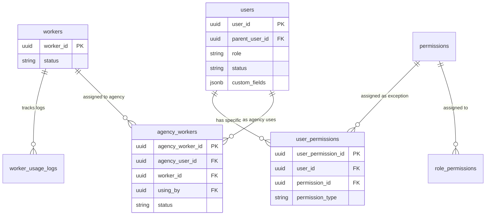

# Database Schema Design: Multi-tenant Agency System

Tài liệu này chi tiết cấu trúc các bảng cơ sở dữ liệu (Dạng phẳng, không bao gồm Transactions).

## 📝 Quy tắc thiết kế (Naming Rules)

- **Tên bảng**: Sử dụng số nhiều (Plural).
- **Khóa chính (PK)**: Luôn là `[table_name_singular]_id` với kiểu dữ liệu `UUID`.
- **Timestamps**: Mỗi bảng phải có 3 trường: `created_at`, `updated_at`, `deleted_at`.
  - **Kiểu dữ liệu**: `TIMESTAMPTZ` (UTC).
  - **Định dạng Output**: ISO 8601 (ví dụ: `2024-04-09T08:00:00Z`).

---

## 🏗️ Các bảng chi tiết (Tables)

### 1. `users`

Bảng trung tâm lưu trữ mọi đối tượng trong hệ thống (`mod`, `agency`, `user`, `customer`).

| Field              | Type        | Description                                                            |
| :----------------- | :---------- | :--------------------------------------------------------------------- |
| **user_id**        | UUID        | Primary Key                                                            |
| **parent_user_id** | UUID        | Self-referencing FK -> `users.user_id` (Đại lý quản lý, Default: NULL) |
| **agency_name**    | String      | Tên doanh nghiệp (Chỉ dành cho role `agency`)                          |
| **phone_number**   | String      | Số điện thoại dùng để đăng nhập Telegram (NOT NULL)                    |
| **role**           | Enum        | Vai trò: `mod`, `agency`, `user`, `customer`                           |
| **status**         | Enum        | Trạng thái: `active`, `disabled` (Default: `active`)                   |
| **custom_fields**  | JSONB       | Lưu trữ các thông tin bổ sung tùy biến                                 |
| **created_at**     | TIMESTAMPTZ | Default: `NOW()` (UTC+Z)                                               |
| **updated_at**     | TIMESTAMPTZ | Default: `NOW()` (UTC+Z)                                               |
| **deleted_at**     | TIMESTAMPTZ | Default: `NULL` (UTC+Z, Soft delete)                                   |

---

### 2. `permissions`

Danh mục các quyền hạn chi tiết.

| Field             | Type        | Description                              |
| :---------------- | :---------- | :--------------------------------------- |
| **permission_id** | UUID        | Primary Key                              |
| **name**          | String      | Tên hiển thị (name permission)           |
| **code**          | String      | Mã định danh quyền (vd: `worker:assign`) |
| **created_at**    | TIMESTAMPTZ | Default: `NOW()` (UTC+Z)                 |
| **updated_at**    | TIMESTAMPTZ | Default: `NOW()` (UTC+Z)                 |
| **deleted_at**    | TIMESTAMPTZ | Default: `NULL` (UTC+Z)                  |

---

### 3. `role_permissions`

Liên kết Vai trò với Quyền hạn.

| Field                  | Type        | Description                                |
| :--------------------- | :---------- | :----------------------------------------- |
| **role_permission_id** | UUID        | Primary Key                                |
| **role**               | String      | Tên vai trò (khớp với `users.role`)        |
| **permission_id**      | UUID        | Foreign Key -> `permissions.permission_id` |
| **created_at**         | TIMESTAMPTZ | Default: `NOW()` (UTC+Z)                   |
| **updated_at**         | TIMESTAMPTZ | Default: `NOW()` (UTC+Z)                   |
| **deleted_at**         | TIMESTAMPTZ | Default: `NULL` (UTC+Z)                    |

---

### 4. `workers`

Lưu trữ thông tin các worker khả dụng trong hệ thống.

| Field          | Type        | Description                            |
| :------------- | :---------- | :------------------------------------- |
| **worker_id**  | UUID        | Primary Key                            |
| **name**       | String      | Tên worker                             |
| **status**     | String      | Trạng thái: `ready`, `busy`, `offline` |
| **created_at** | TIMESTAMPTZ | Default: `NOW()` (UTC+Z)               |
| **updated_at** | TIMESTAMPTZ | Default: `NOW()` (UTC+Z)               |
| **deleted_at** | TIMESTAMPTZ | Default: `NULL` (UTC+Z)                |

---

### 5. `agency_workers`

Phân bổ Worker cho từng Đại lý và theo dõi người dùng đang sử dụng.

| Field                | Type        | Description                                         |
| :------------------- | :---------- | :-------------------------------------------------- |
| **agency_worker_id** | UUID        | Primary Key                                         |
| **agency_user_id**   | UUID        | Foreign Key -> `users.user_id` (Cấp Agency)         |
| **worker_id**        | UUID        | Foreign Key -> `workers.worker_id`                  |
| **using_by**         | UUID        | Foreign Key -> `users.user_id` (Người đang/đã dùng) |
| **status**           | Enum        | Trạng thái: `active`, `completed`, `revoked`        |
| **created_at**       | TIMESTAMPTZ | Default: `NOW()` (UTC+Z)                            |
| **updated_at**       | TIMESTAMPTZ | Default: `NOW()` (UTC+Z)                            |
| **deleted_at**       | TIMESTAMPTZ | Default: `NULL` (UTC+Z)                             |

---

### 6. `worker_usage_logs`

Lịch sử sử dụng worker (Dùng cho audit, billing và thống kê).

| Field              | Type        | Description                                               |
| :----------------- | :---------- | :-------------------------------------------------------- |
| **usage_log_id**   | UUID        | Primary Key                                               |
| **worker_id**      | UUID        | Foreign Key -> `workers.worker_id`                        |
| **agency_user_id** | UUID        | Foreign Key -> `users.user_id` (Agency chịu trách nhiệm)  |
| **user_id**        | UUID        | Foreign Key -> `users.user_id` (Người trực tiếp thao tác) |
| **start_at**       | TIMESTAMPTZ | Thời điểm bắt đầu sử dụng                                 |
| **end_at**         | TIMESTAMPTZ | Thời điểm kết thúc (Null nếu đang dùng)                   |
| **metadata**       | JSONB       | Lưu thông số kỹ thuật hoặc kết quả công việc              |
| **created_at**     | TIMESTAMPTZ | Default: `NOW()` (UTC+Z)                                  |

---

### 7. `user_permissions`

Quyền ngoại lệ (Overrides) dành riêng cho từng User, ghi đè lên quyền mặc định của Role.

| Field                  | Type        | Description                                |
| :--------------------- | :---------- | :----------------------------------------- |
| **user_permission_id** | UUID        | Primary Key                                |
| **user_id**            | UUID        | Foreign Key -> `users.user_id`             |
| **permission_id**      | UUID        | Foreign Key -> `permissions.permission_id` |
| **permission_type**    | Enum        | `allow` (Cho thêm), `deny` (Cấm quyền)     |
| **created_at**         | TIMESTAMPTZ | Default: `NOW()` (UTC+Z)                   |

---

## 🔗 Sơ đồ quan hệ (Entity Relationship)

---

## 🧠 Ghi chú kỹ thuật (Technical Notes)

- **Flattened Structure**: Thông tin Đại lý nằm trực tiếp tại bảng `users`.
- **Data Isolation**: Truy vấn phải luôn filter theo `parent_user_id` hoặc `agency_user_id`.
- **Worker Assignment**: Mỗi khi Worker được giao cho người mới, bản ghi cũ trong `agency_workers` sẽ chuyển sang `status='completed'` và một bản ghi mới được tạo ra.
- **Soft Delete**: Mọi bảng đều hỗ trợ `deleted_at`.
- **Timestamps & UTC**: Tất cả các trường thời gian sử dụng chuẩn ISO 8601 với hậu tố `Z`.
- **Permission Logic (Hybrid RBAC)**: Quyền cuối cùng của User = (Quyền của Role từ `role_permissions`) + (Quyền `allow` từ `user_permissions`) - (Quyền `deny` từ `user_permissions`).

---
